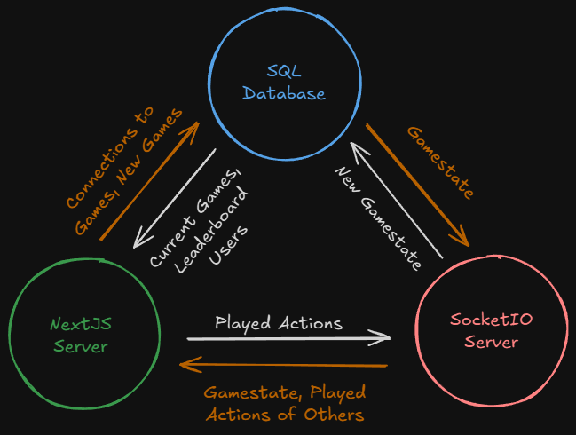

# Haggle

A NextJS, online card game perfect for ruining friendships.

## 1. How to use

Change directories in two terminals to both `/client` and `/game_server`. Follow
the necessary instructions there to run the corresponding service!

## 2. Planned layout

    

### i. Page Routes

Here are the planned functionalities for the different routes:

- `/`
    - nav bar to `/` and `/rules`
    - nav bar includes About button that pulls up modal
    - haggle coin in center allows for offline play
    - user can play online
        - join existing lobby
            - use code to join directly
            - join a random lobby with a button
        - host a new lobby
            - adds lobby to database

- `/rules`
    - nav bar to `/` and `/rules`
    - explains the game
        - plenty of visuals?

- `/play/offline`
    - user can play a game locally
    - game screen should take up most of the area
    - disconnect button in bottom right corner
    - <b>single player should be implemented first</b>

- `/play/online/[gameCode]`
    - `gameCode` is UNIQUE, case-insensitive string of 6 letters (a-z)
    - use can play a game online
    - game screen should take up most of the area
    - disconnect button in bottom right corner

### ii. Models

We'll be using Sequelize as the ORM, but here's the lobby model:

> 

> <h3>Lobby</h3>
>
> | Field | Datatype | Constraints | Justification |
> | -------- | ------- | ------- | ----- |
> | `code` | `string` | unique, required | Needed for API and page access |
> | `numPlayers` | `number` | required | Number of players in lobby |
> | `private` | `boolean` | required | Restrict "random play" button search |
> | `state` | `string` | required, CANNOT be empty | Current state of lobby |

### iii. API Routes

- `/lobbies`
    - GET for getting all public lobbies
    - POST for creating a new lobby

- `/lobbies/gameCode`
    - join *any* lobby given code
    - GET for getting state of lobby
    - PUT for updating state of lobby OR updating number of players
    - DELETE for deleting a lobby

> [!NOTE]
> More details regarding communication between the websocket server and
> NextJS application will be specified later into development. The same
> goes for interactions between the websocket server and the database.