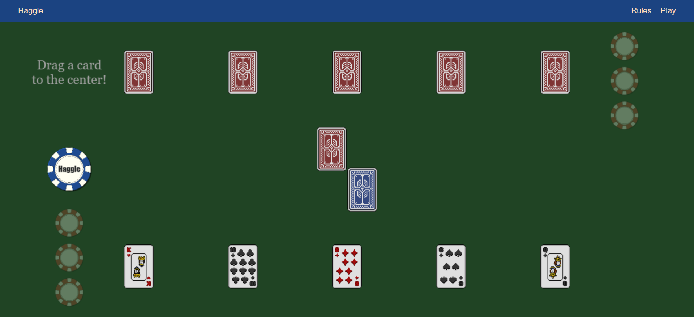
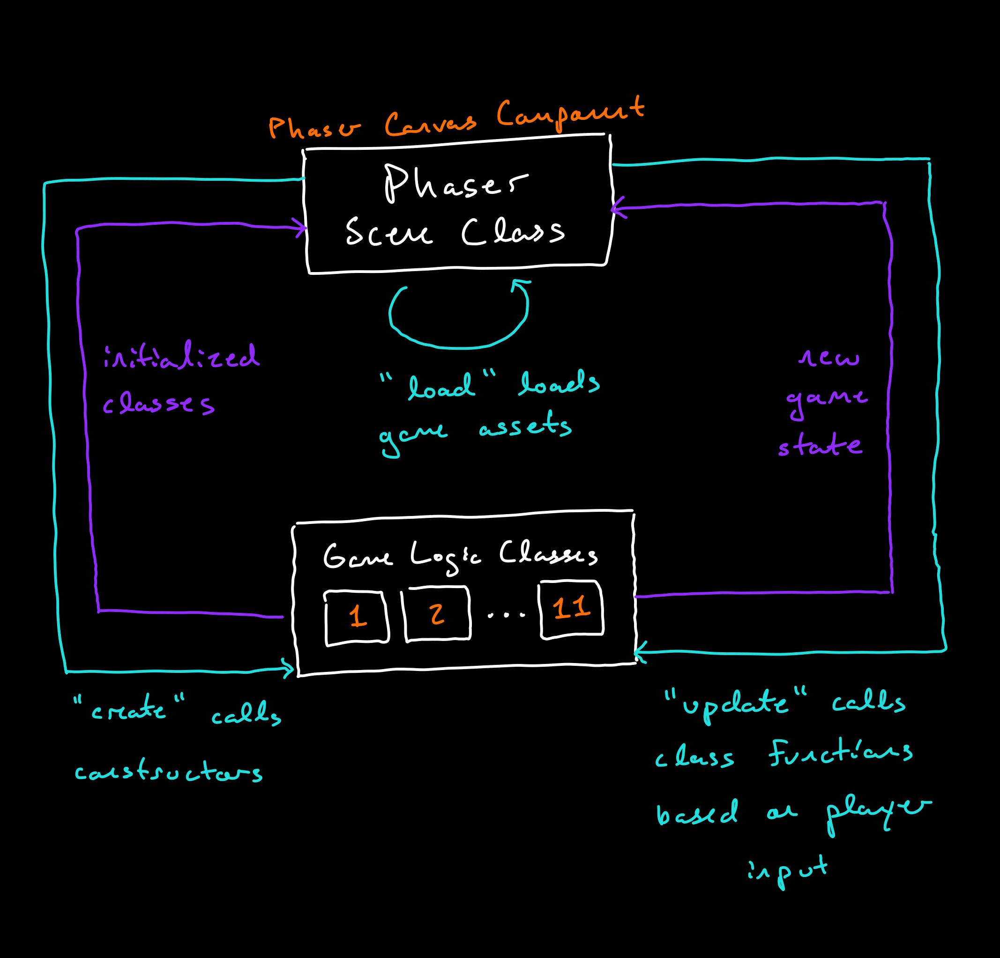

# Haggle

<p align="center">
    
</p>

A NextJS, online card game perfect for ruining friendships.

Thank you so much to Olex Mazur over on itch.io for creating the free sound effects that we used.


## 1. How to use

Simply run the following commands in the root directory of this project:
```
pnpm i
pnpm run dev
```

Then, open your browser to `http://localhost:3000`!

## 2. Planned layout

<p align="center">
    
</p>


### i. Page Routes

Here are the planned functionalities for the different routes:

- `/`
    - nav bar to `/` and `/rules`
    - nav bar includes About button that pulls up modal
    - haggle coin in center allows for offline play
    - user can play online
        - join existing lobby
            - use code to join directly
            - join a random lobby with a button
        - host a new lobby
            - adds lobby to database

- `/rules`
    - nav bar to `/` and `/rules`
    - explains the game

- `/play`
    - Same nav bar
    - Actual Phaser game component
